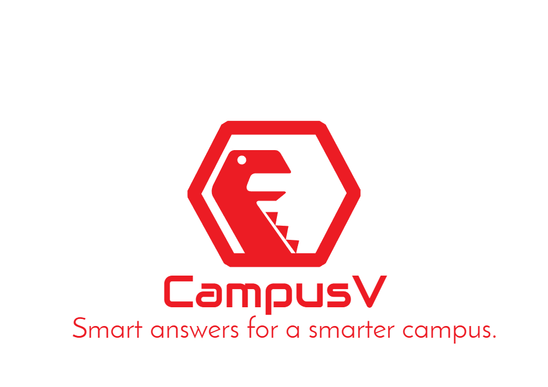
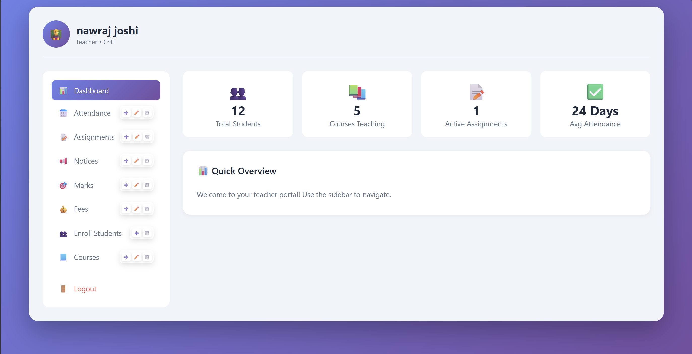
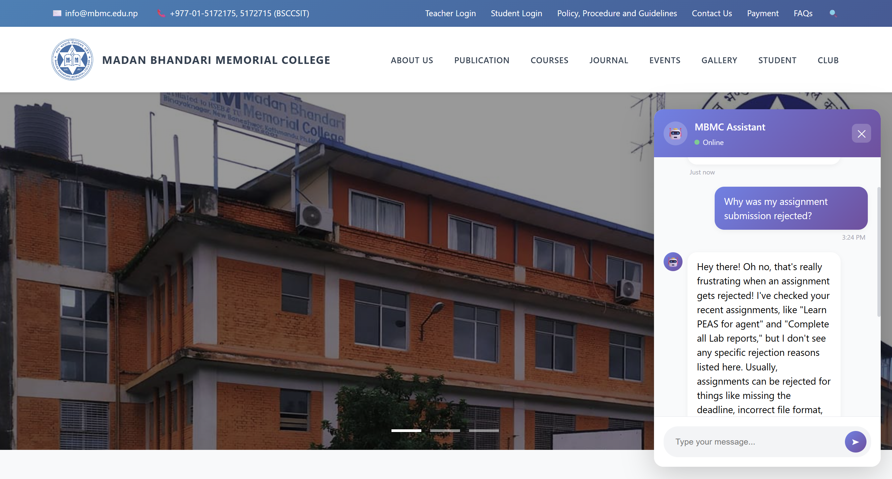
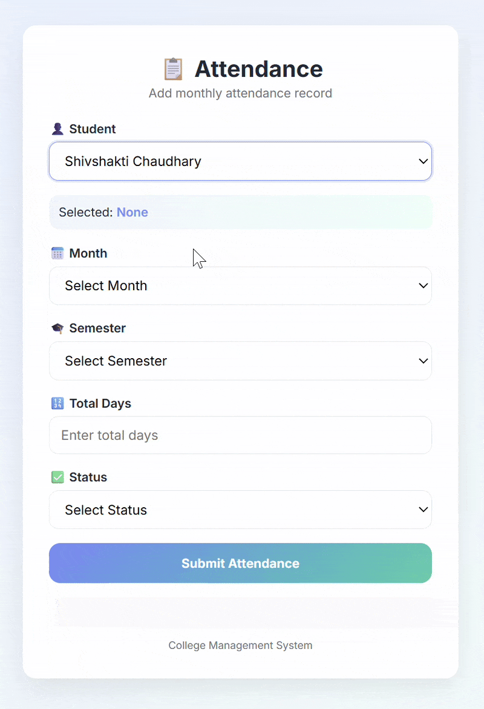
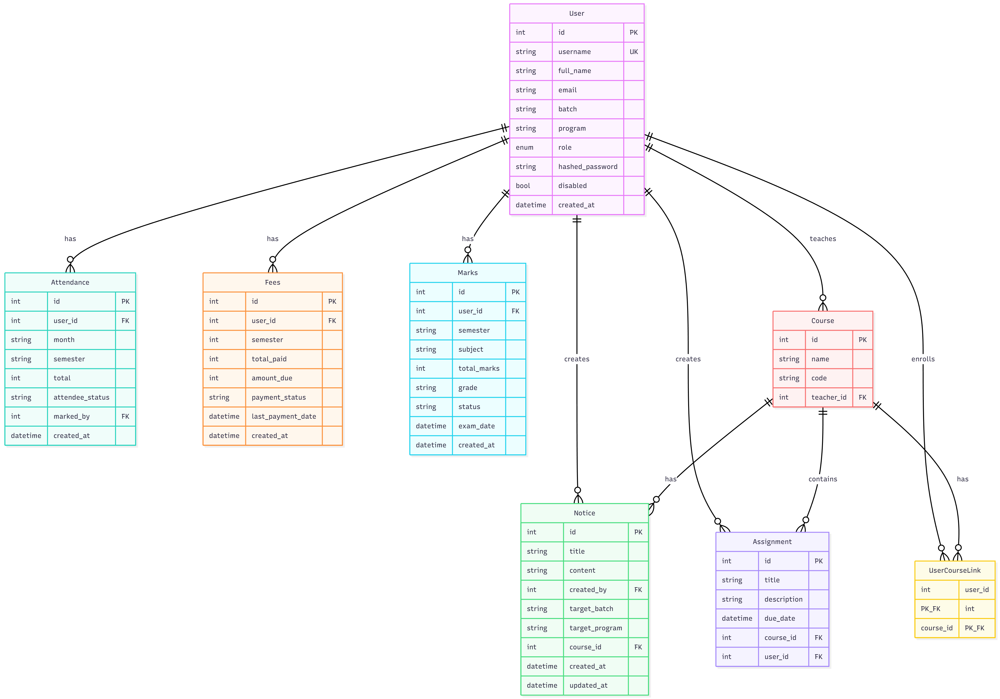
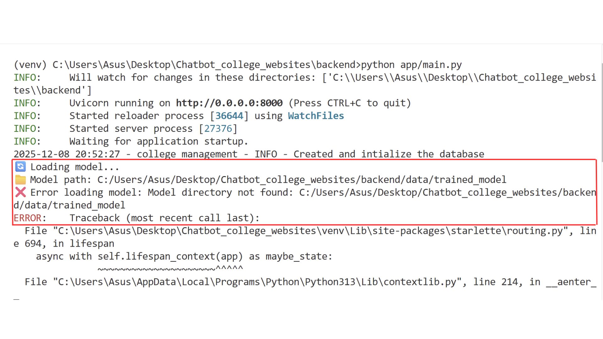
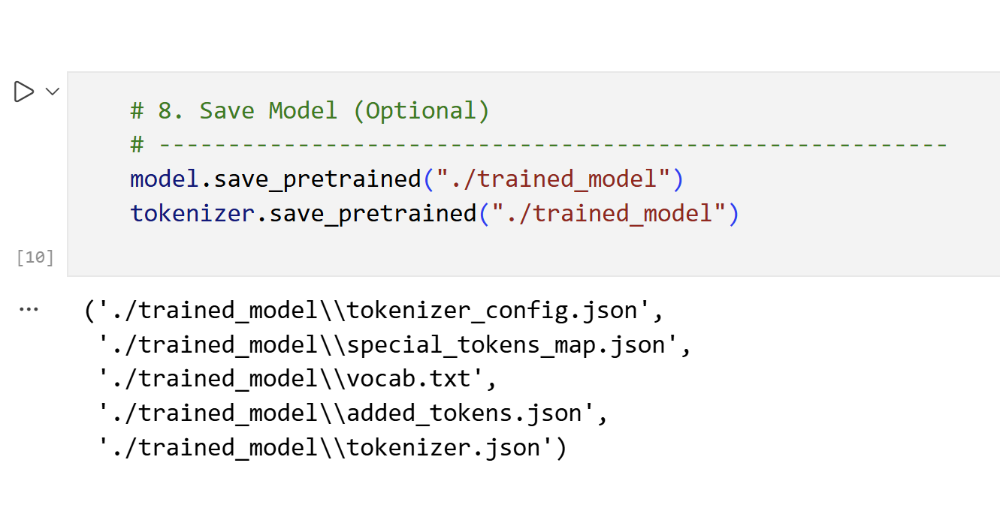

<!-- Centered Logo and Title -->
<div align="center">
  
</div>


<div align="center">

  <!-- Contributors Badge (example, customize with more info if needed) -->
[](#)
[](https://opensource.org/licenses/MIT)
</div>


<div align="center">

<!-- Tech badges -->
[](#)
[](#)
[](#)
[](#)
[](#)
[](#)
[](#)
[](#)
[](#)
[](https://docs.docker.com/get-started/)

</div>

## Introduction

A Smart Chatbot for College Management System that modernizes campus workflows and student–teacher interaction using AI-driven automation.

The system provides:

* Instant Q/A support
* Attendance management
* Assignments & academic records
* Fee & course information
* Role-based dashboards for teachers and students

Built with Python, FastAPI, SQLModel, LLMs, and a lightweight HTML/CSS/JS frontend, deployed with Docker, the platform is designed for scalability, adaptability, and ease of use.

---

## UI Preview

### Teacher Dashboard



### Student Chatbot



### Attendance Workflow



---

## System Architecture

<p align="center">
  
</p>

Figure: High-level chatbot architecture

### Architecture Overview

The system is composed of four primary layers:

1. Frontend (HTML, CSS, JS)
   * Role-based UI (Student / Teacher)
   * Chat interface
   * Dashboard & CRUD workflows

2. Backend (FastAPI)
   * RESTful APIs
   * JWT-based authentication
   * Role-based access control (RBAC)

3. AI & Retrieval Layer
   * Query classification (ML model)
   * Pinecone vector database (college knowledge base)
   * LLM-based response generation

4. Data Layer
   * SQLModel & SQLite
   * Structured academic records

---

## Data Flow

1. User submits a query via the frontend.
2. Backend authenticates the request using JWT.
3. Query is passed to the Query Classifier.
4. Based on classification:
   * User-specific data → SQL database
   * College knowledge → Pinecone vector search
   * Out-of-scope queries → General web search
5. Retrieved documents are formatted.
6. Context is sent to the LLM (Groq / Gemini).
7. Optimized response is returned to the user.

---

## Chatbot Workflow

### Query Classification

Queries are classified into:

* General Information
* College Information
* Attendance
* Marks
* Fees
* Courses Enrolled

### Data Retrieval Strategy

| Query Type                | Data Source        |
| ------------------------- | ------------------ |
| Attendance / Marks / Fees | SQL Database       |
| College Info              | Pinecone Vector DB |
| Irrelevant / External     | General Web Search  |

### Response Generation

Retrieved context is refined and passed to an LLM for:

* Natural language generation
* Response optimization

---

## Authentication & Permissions

### Authentication

* JWT-based authentication
* Token expiration enforced
* Secure secret key & algorithm

### Authorization (RBAC)

| Role             | Permissions                                                |
| ---------------- | ---------------------------------------------------------- |
| Teacher          | Create / Update / Delete students, attendance, marks, fees |
| Student          | View own data, interact with chatbot                       |
| Admin (optional) | System-level controls                                      |

---

## Database Models

The backend uses normalized SQLModel schemas for maintainability and performance.

<p align="center">
  
</p>

Figure: SQLModel database schema

---

## Environment Configuration

Before running the project, create a `.env` file:

```env
# JWT
SECRET_KEY=xxxxxxxxxxxxxxxxx
ALGO="HS256"
ACCESS_TOKEN_EXPIRE=30

# AI Providers
GOOGLE_API_KEY=AIzaxxxxxxxxxxxx
GROQ_API_KEY=gsk_xxxxxxxxxxxxx

# Pinecone
PINECONE_API_KEY=pcsk_xxxxxxxxxxxxx
PINECONE_INDEX_NAME="mbmc-college-website"
PINECONE_ENVIRONMENT="us-east-1"

# App Config
FRONTEND_URL="https://domain_name.com"
DATABASE_URL=sqlite:///data/database.db
ENVIRONMENT=production
DEBUG=False
```

---

## Installation

### Docker Installation (Recommended)

```bash
docker pull shivahchaudhary46/college_chatbot_backend:latest
docker pull shivahchaudhary46/college_chatbot_frontend:latest

docker images
```

#### Run Containers Individually

```bash
docker run -d -p 8000:8000 shivahchaudhary46/college_chatbot_backend:latest
docker run -d -p 5500:80 shivahchaudhary46/college_chatbot_frontend:latest
```

#### Docker Compose

```bash
docker compose up
```

---

## Manual Installation

```bash
git clone https://github.com/shivachaudhary46/college_chatbot.git
cd college_chatbot
```

### Python Compatibility

* Python 3.10 or 3.11

```bash
python -m venv venv
source venv/bin/activate
pip install -r requirements.txt
pip list
```

---

## Training the Classification Model (Required)

If you see:

<p align="center">
  
</p>

Do not panic.

1. Open `Classification.ipynb`
2. Run all cells
3. Trained model will be saved to `backend/data/`

<p align="center">
  
</p>

---

## Running the Application

### Backend

```bash
cd backend
python app/main.py
```

or

```bash
uvicorn app.main:app --host 0.0.0.0 --port 8000 --reload
```

### Frontend

Open directly or via Docker:

```
http://127.0.0.1:5500
```

---

## URLs

* Frontend: [http://127.0.0.1:5500](http://127.0.0.1:5500)
* Backend API: [http://127.0.0.1:8000/api/v1/](http://127.0.0.1:8000/api/v1/)

---

> References

Here are the Links I used for references,
| References   | Documentation Links |
|--------------|---------------------|
| FastAPI      | [](https://fastapi.tiangolo.com/tutorial/first-steps/) |
| Langchain    | [](https://docs.langchain.com/oss/python/langchain/quickstart) |
| Python       | [](https://docs.python.org/3/) |
| Pandas       | [](https://pandas.pydata.org/docs/) |
| Transformers | [](https://huggingface.co/docs/transformers/en/index) |
| Pinecone     | [](https://docs.pinecone.io/guides/index-data/create-an-index) |
| SQLModel     | [](https://sqlmodel.tiangolo.com/) |
| Crawl4AI     | [](https://docs.crawl4ai.com/blog/releases/0.4.2/) |
| Docker       | [](https://docs.docker.com/get-started/) |

