<!-- Centered Logo and Title -->
<div align="center">
  
</div>


<div align="center">

  <!-- Contributors Badge (example, customize with more info if needed) -->
[](#)
[](https://opensource.org/licenses/MIT)


<div align="center">

<!-- Tech badges -->
[](#)
[](#)
[](#)
[](#)
[](#)
[](#)
[](#)
[](#)
[](#)
[](#)
[](#)
[](#)
[](#)
[](#)
[](#)
[](#)
[](#)
[](#)
[](#)
[](#)
[](#)


# Introduction

A Smart Chatbot for College Management System revolutionizes campus workflows and student-teacher interaction which leverages AI to provide instant support for campus queries (Q/A) , attendance, assignments, and so on.

It is built using a robust Python, FastAPI, and top ML/AI libraries, stack—HTML, CSS, JS. It designed for scalability, adaptability and very easier to use.


---

# Features for Teachers
- ### Create account
  <div style="display: flex; gap: 28px; justify-content: center;">
    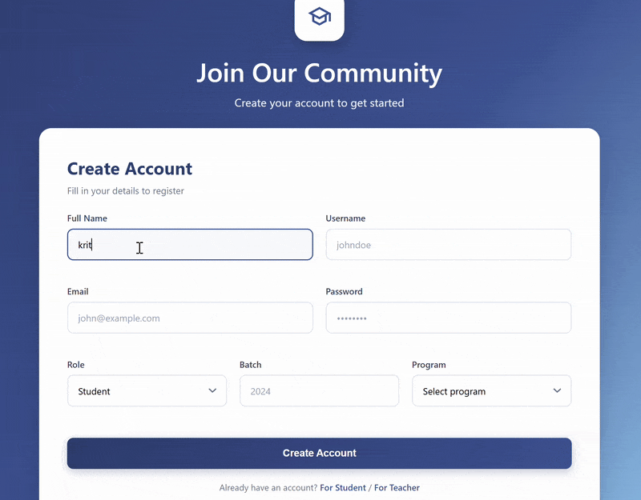
  </div>

- ### Student Chatbot & Dashboard
  <div style="display: flex; gap: 18px; justify-content: center;">
    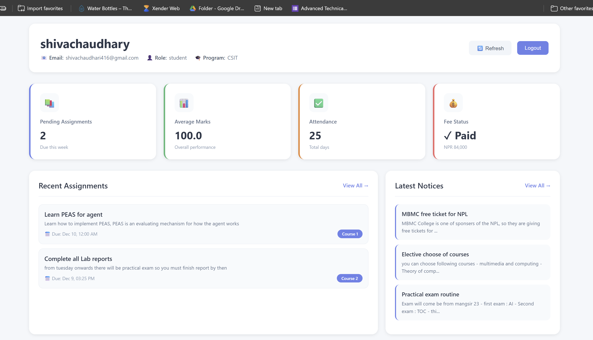
    
  </div>

- ### Attendance Management
  <div style="display: flex; gap: 12px; justify-content: center;">
    
    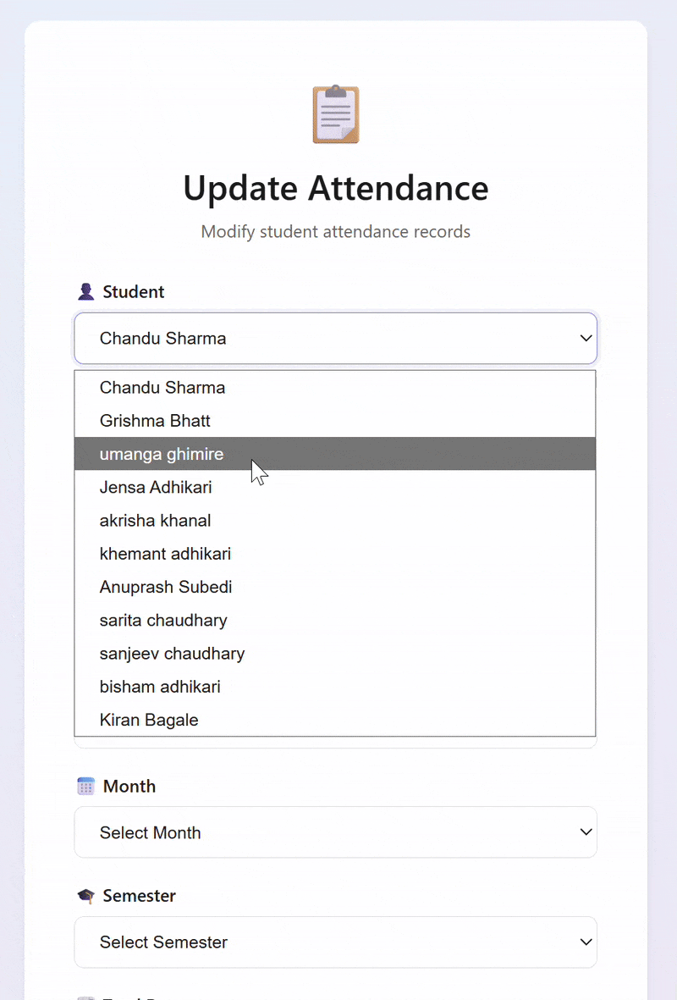
    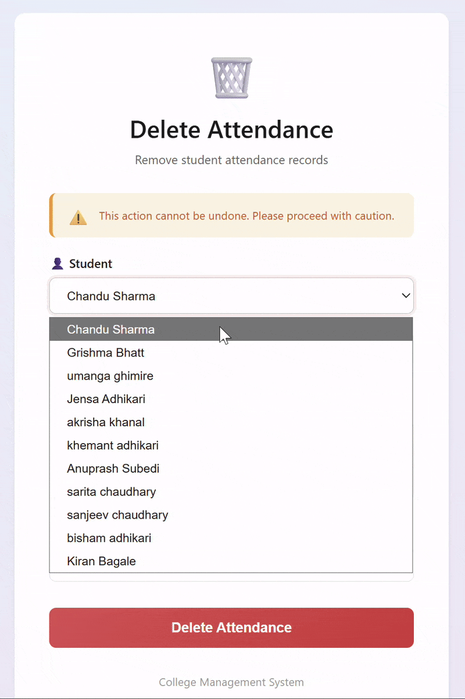
  </div>

- ### Assignment Management
  <div style="display: flex; gap: 12px; justify-content: center;">
    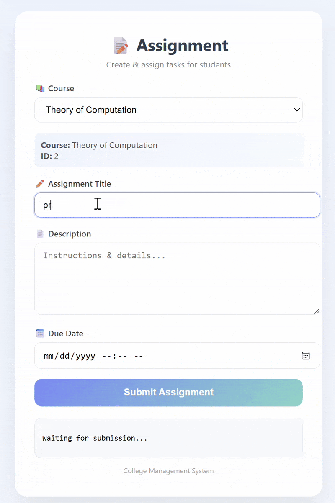
    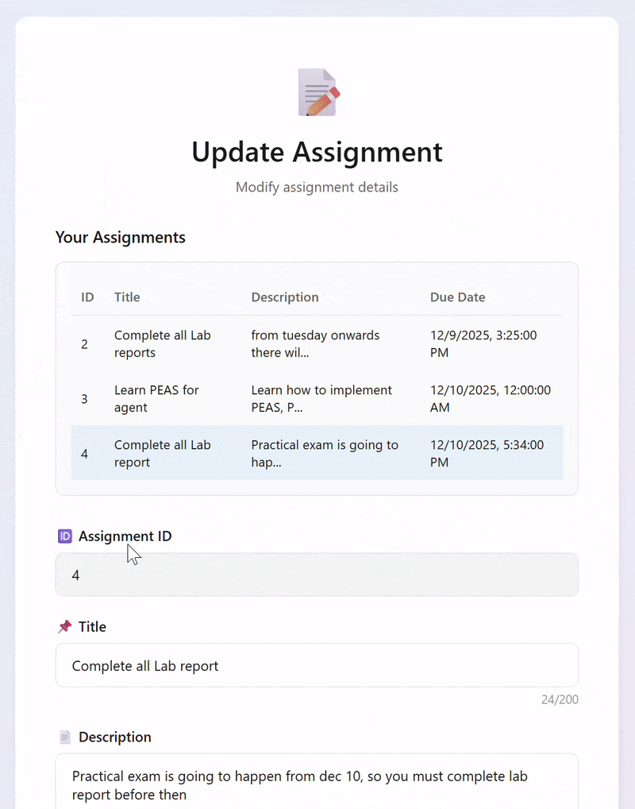
    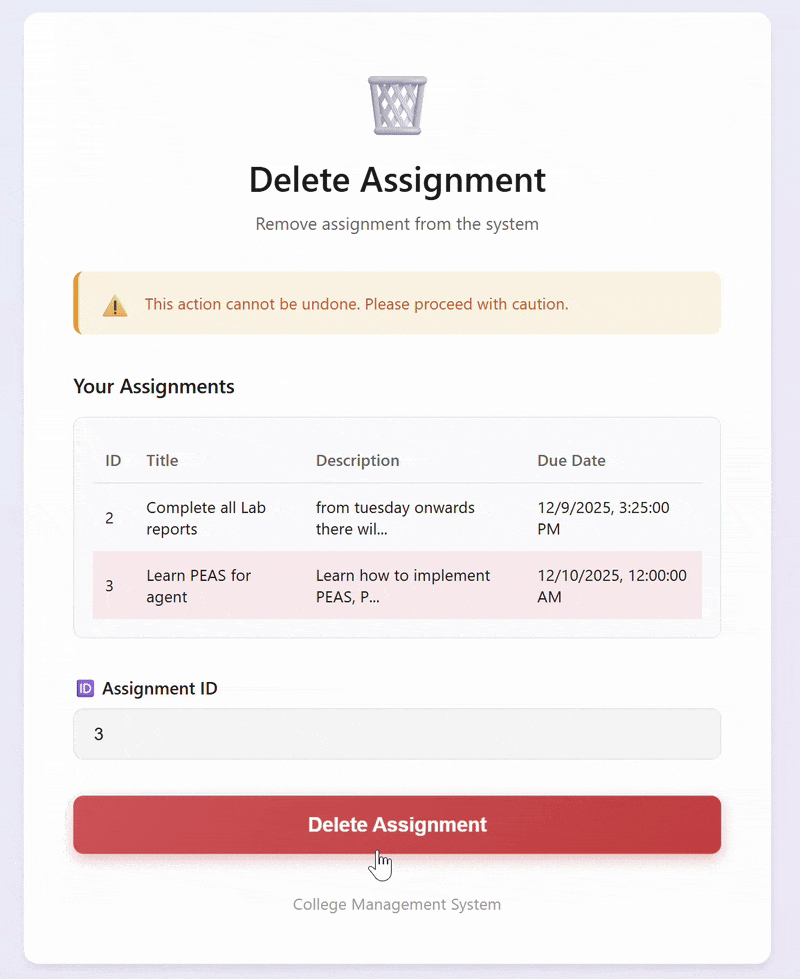
  </div>

- ### Marks Management
  <div style="display: flex; gap: 12px; justify-content: center;">
    
    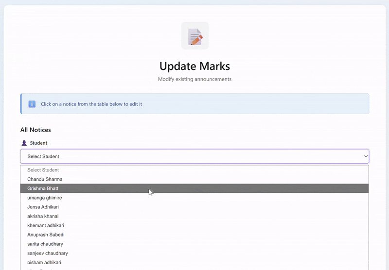
    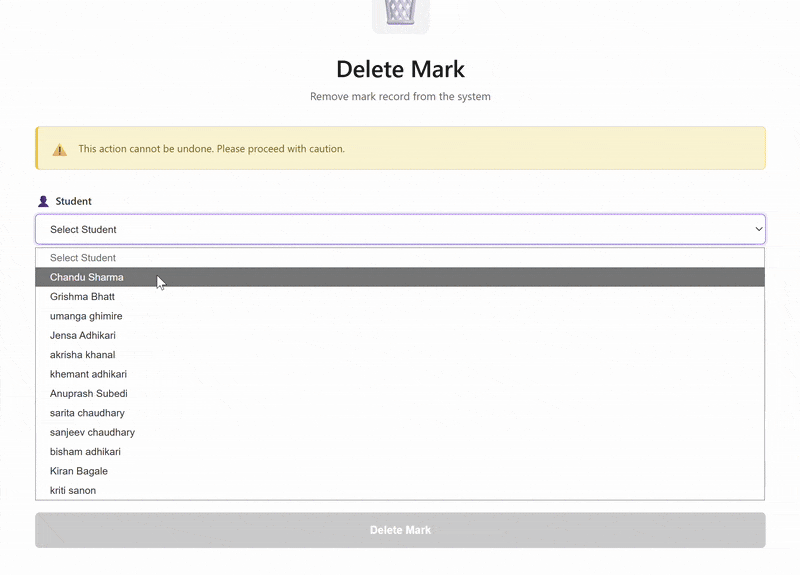
  </div>

- ### Notice Management
  <div style="display: flex; gap: 12px; justify-content: center;">
    
    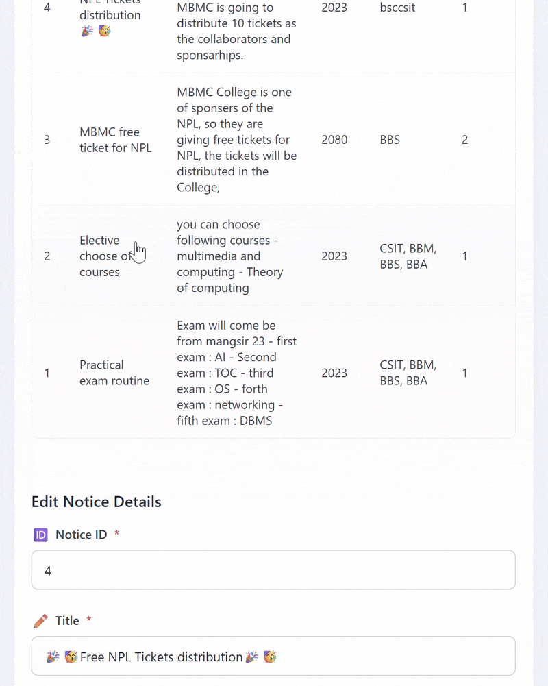
    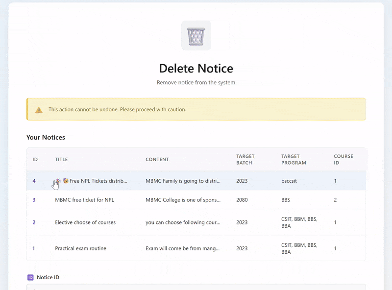
  </div>


- ### Fee Management
<div style="display: flex; gap: 12px; justify-content: center;">
    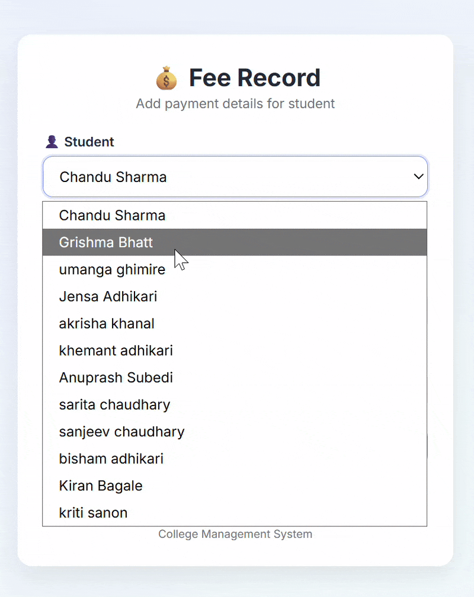
    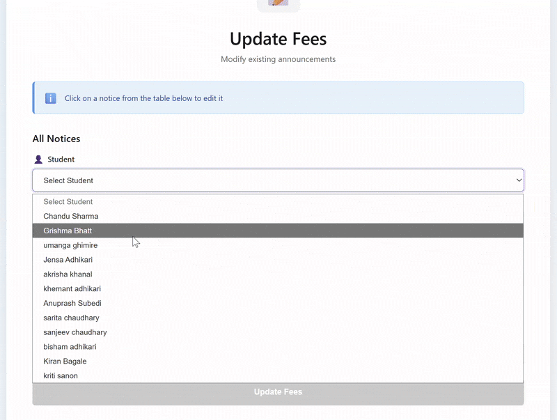
    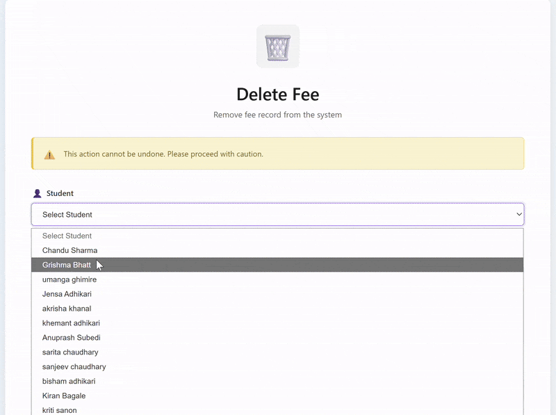
</div>

- ### Course
  <div style="display: flex; gap: 12px; justify-content: center;">
    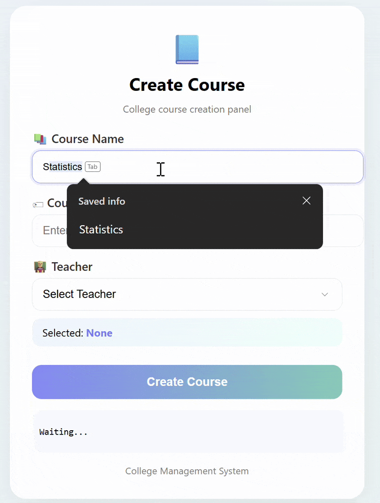
    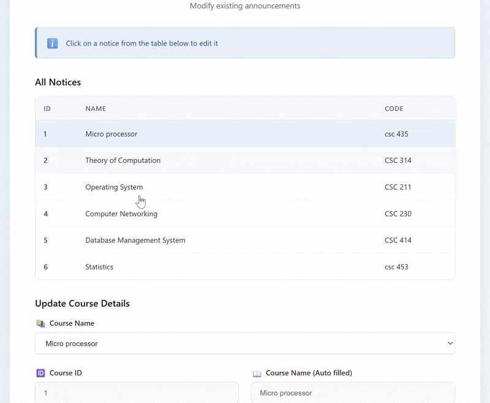
    
</div>

- ### Dashboard Overview
  <div style="display: flex; gap: 28px; justify-content: center;">
    
  </div>
---

## Chatbot Architecture and Workflow

The chatbot processes user queries through a multi-stage pipeline that categorizes, retrieves, and formats information before delivering responses.

**Query Classification**
When users submit queries regarding college information, attendance records, academic marks, fee details, enrolled courses, or record updates, the system classifies each query into one of the following categories: General Information, College Information, Attendance, Marks, Fees, or Courses Enrolled.

**Data Retrieval**
The system employs a conditional data retrieval strategy:
- For user-specific queries (attendance, marks, fees, enrolled courses), the system fetches data directly from the SQL database.
- For irrelevant or out-of-scope queries, the system performs a web search via DuckDuckGo and returns the search results.
- For general college-related queries, the system retrieves information from a Pinecone vector database. This database was populated using the Crawl4AI API to crawl and index the college website content.

**Response Generation**
Before delivering the final response, the system formats the retrieved documents and passes them to a Large Language Model (LLM) for optimization and natural language generation.

**Response Delivery**
The processed response is then returned to the user.

<p align="center">
  
</p>
Fig: Architecture of chatbot

---

## Database Models

The backend leverages robust, normalized models enabling efficient data management.

<p align="center">
  
</p>
Fig: Database models of SQLModel 
---

## Installation

### With Docker


### Manual Installation

First fork this repository 

```bash
# Clone the repo
git clone https://github.com/shivachaudhary46/college_chatbot.git

cd college_chatbot

## NOTE: Python==3.11 or Python==3.10 is Compatible versions

# create new virtual environment 
python3 -m venv venv

# install all neccessary packages 
pip3 install -r requirements.txt 

# check list of packages 
pip3 list 
```

One last step is remaining to complete before we run our app, 

<p align="center">
  
</p>

If you see Error Loading model, don't worry, 

<p align="center">
  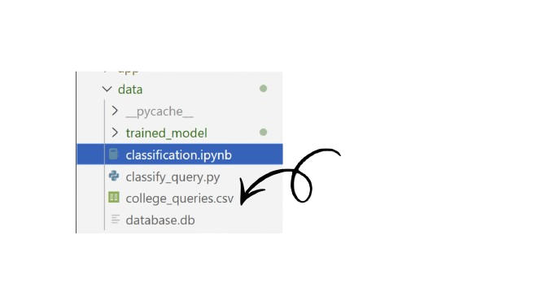
</p>

You can see Classification.ipynb right. First, you have to trained model. Run each cell in classification model, the trained_model will come in backend/data. Run classificiation.ipynb all cells 

<p align="center">
  
</p>
Fig: Trained_model shown 

to run the app

first go to the
```bash

cd backend 

python app/main.py 

# another way

cd backend

uvicorn app.main:app --host 0.0.0.0 --port 8000 --reload --reload-exclude backend/logs/*

```

**Frontend:**
```bash
cd frontend
# (Adapt commands for your frontend stack)
npm install
npm start
```

**Backend:**
```bash
cd backend
pip install -r requirements.txt
uvicorn main:app --reload
```
| Docker                   | Manual                        |
|--------------------------|------------------------------|
| Rapid setup              | Customizable configuration   |
| Encapsulated dependencies| Direct control of each part  |
| Easier deployment        | Local installation           |

---

## URLs

**Frontend URL:** [`http://127.0.0.1:5500`](http://127.0.0.1:5500)  
**Backend API:** [`http://127.0.0.1:8000/api/v1/`](http://127.0.0.1:8000/api/v1/)

---

> "Chatbot Logo": Chatbot